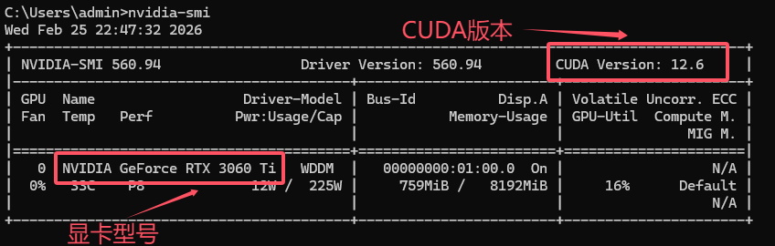
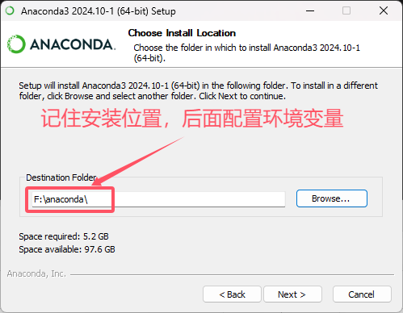
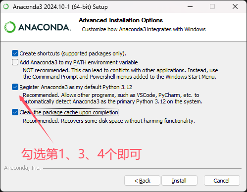
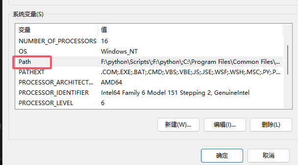
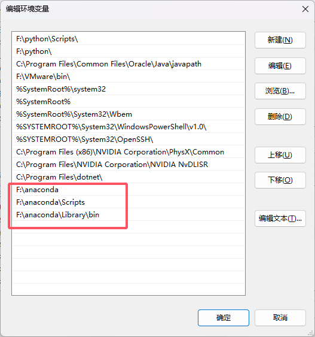
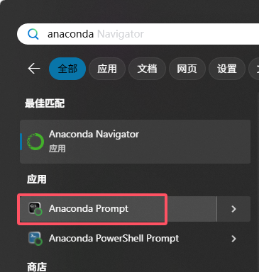
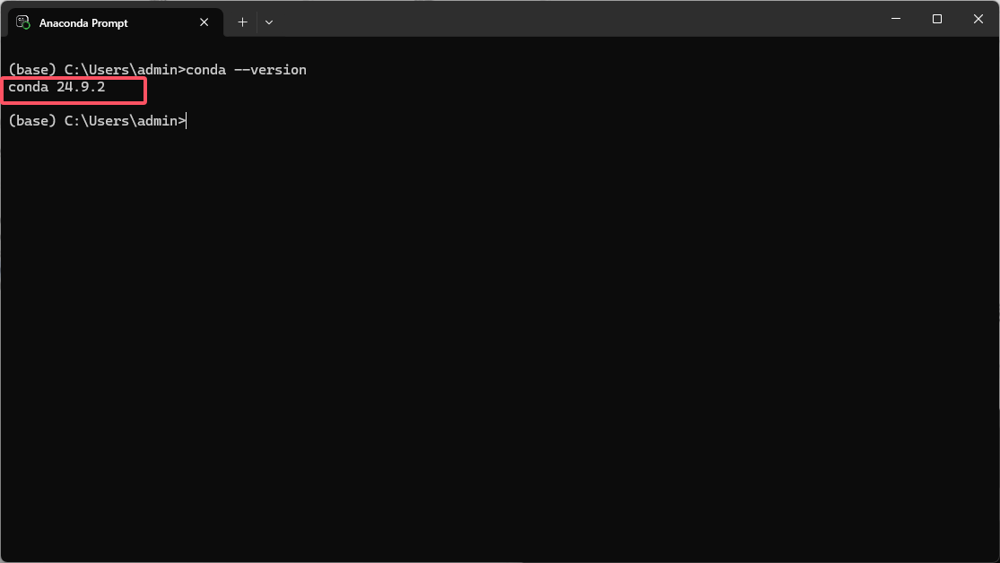
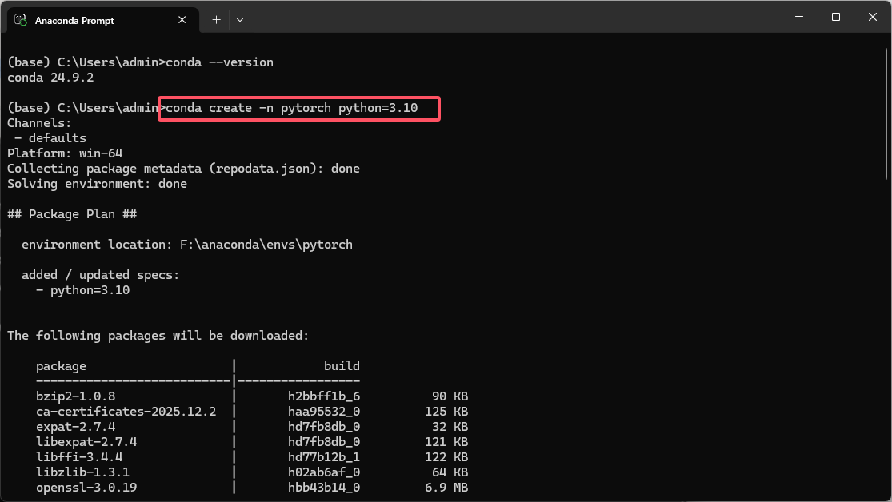
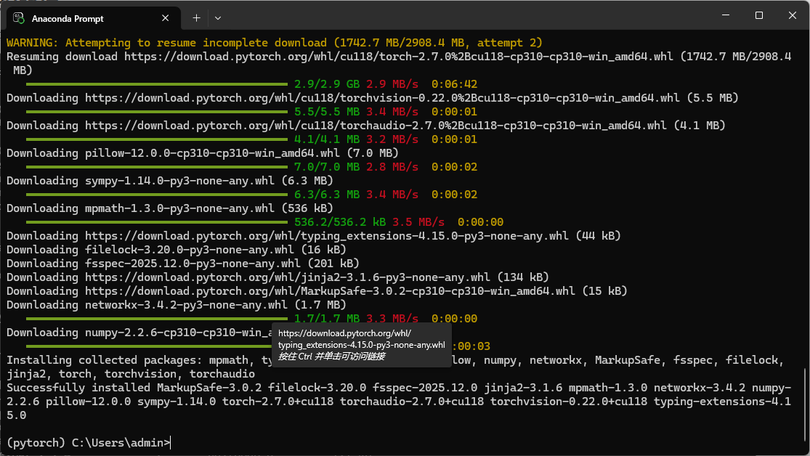
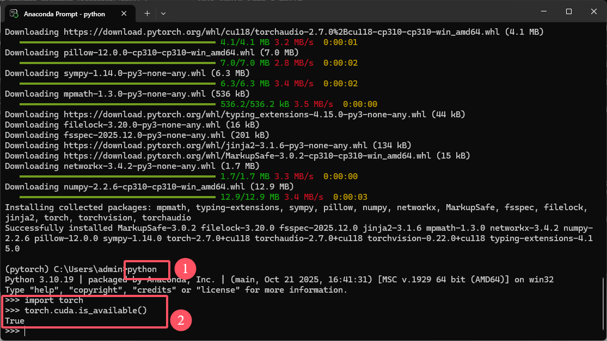

# Pytorch 环境搭建

## 先查看自己是否有GPU

cmd中输入nvidia-smi查看自己显卡型号和CUDA版本

## 安装Anaconda

下载地址：[Index of /anaconda/archive/ | 清华大学开源软件镜像站 | Tsinghua Open Source Mirror](https://mirrors.tuna.tsinghua.edu.cn/anaconda/archive/)

### 配置环境变量

环境变量里选择path

添加这三个环境变量后保存

### 验证是否安装成功

打开Anaconda Prompt后输入conda --version回显版本号代表安装成功

## 创建虚拟环境

conda create -n pytorch python=3.10

## 激活虚拟环境

conda activate pytorch

下载pytorch

pip install torch==2.7.0 torchvision==0.22.0 torchaudio==2.7.0 --index-url https://download.pytorch.org/whl/cu118

验证是否安装成功，返回True代表安装成功了

